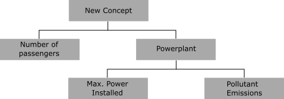
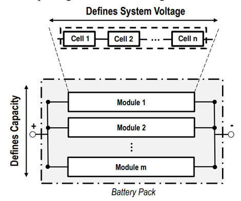
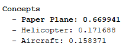
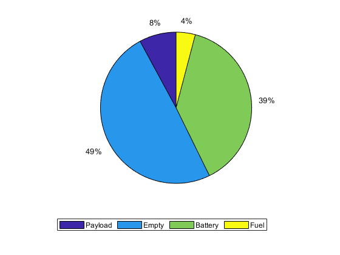

# **User manual**
This is the user manual of the Aircraft Design Tool (ADT) for assisting students in the conceptual design of aircraft for MECH 475/580 at the University of Victoria (BC, Canada) and Projeto Integrador at Tecnico Lisboa (Lisbon, Portugal). The following researchers contributed to the current state of the tool:
 * **Dr. Bras**, Post-Doctoral researcher at UVic's Centre for Aerospace Research (CfAR),
 * **Ricardo Marques**, PhD candidate at UVic,
 * **Dr. Frederico Afonso**, assistant professor at Tecnico Lisboa, Portugal. 
 * **Dr. Afzal Suleman**, professor at UVic and Tecnico Lisboa. 
 
This document describes the structure and current functionalities of the tool. The tool is continuously being updated and any suggestions on modifications/additions to the tool are always welcome!

<a id='toc'></a>
## **Table of Contents**
1. [Motivation](#motivation)
2. [Capabilities/Limitations](#capabilities-limitations)
3. [Files](#files)
4. [JSON file](#json_file)
    1. [Editing tools](#editing_tools)
    2. [Structure](#structure)
        1. [Concept](#concept)
        2. [Mission](#mission)
        3. [Vehicle](#vehicle)
        4. [Energy](#energy)
5. [MATLAB](#matlab)
   1. [How to run](#how_to_run)
   2. [Output](#output)
   3. [Theory](#theory)

<a id='motivation'></a>
## **Motivation**
The tool was first developed in 2019 by Professor Afzal Suleman's students, Dr. Mario Bras and Ricardo Marques, to help students in the conceptual design process of aircraft with VTOL capabilities for the Aircraft Design's project taught at the University of Victoria (BC, Canada) and Tecnico Lisboa (Lisbon, Portugal). The methodology and models considered in this tool follow, in most part, the ones taught in the Aircraft Design course. 

[Back to ToC](#toc)

<a id='capabilities-limitations'></a>
## **Capabilities/Limitations**
* Fixed-wing concepts with added VTOL capabilities can be considered. Multi-rotor concepts are currently not considered in the tool (cruise segment only considers wing as lifting surface).


* Fuel and batteries can be considered as, either complementary, or individual energy sources. Fuel cells may currently be considered as batteries despite hydrogen weight reduction not being accounted for. 
* For the moment, vertical flight segments can only use battery as energy source.

[Back to ToC](#toc)

<a id='files'></a>
## **Files**
There are two main components in the tool:
* MATLAB function files where all calculations are performed. The following functions have been implented:
  * Analytical Hierarchy Process (AHP)  
  * Weights and cg position estimates
  * Design space analysis
  * Aerodynamic analysis
  * Propulsion
  * Aircraft plotting (2D top view)
  * $\text{CO}_2$ emissions during production and operation
* An input file containing mission and aircraft parameters.

[Back to ToC](#toc)

<a id='json_file'></a>
## **JSON (JavaScript Object Notation) file** 
The initial version of this tool required students to adjust parameter values in the source code. However, this task increasingly became more challenging with the added complexity to the tool over the years, particularly to those with little to no experience with MATLAB programming. Therefore, the solution sought consisted in separating **MATLAB source code** from **input data** expressed in JSON format. 

The structure of a JSON file consists of *objects* containing pairs of **keys** and **values**. Each *object* is enclosed within brackets. Values used in our JSON file can take the form of strings, numbers, arrays or nested objects.
```json
{
  "Name": "John",
  "age": 25,
  "parents": [
      {
          "name": "Mary",
          "age": 50
      },
      {
          "name": "Peter",
          "age": 52
      }
  ]
}
```

Note that every **key**-**value** pair terminates with a comma **except the last pair of an *object***.

[Back to ToC](#toc)
<a id='editing_tools'></a>
### **Editing tools**
You may consider the following tools to visualize and edit your project's JSON file:
1. **[Visual Studio Code](https://code.visualstudio.com/)**: this is our preferred free code editor due to its visually-aiding features such as coloured and tabbed text, and detection of syntax errors. You may also use this software to code in other programming languages by installing their respective interpreters.
2. **[Online JSON file editors](https://jsoneditoronline.org/)**: similar functionalities to VS code's but without a software download. Different parts of the file are also highlighted with different colours and warning messages for syntax errors are output.
3. **MATLAB or notepad**: simpler options with no colour highlighting that still get the job done.

[Back to ToC](#toc)
<a id='structure'></a>
### **Structure**
The JSON file is separated in four objects, each containing parameters of the concept aircraft and desired mission profile:
* **Concept**: includes names of different designs initially proposed by students and matrices with relative performance between designs and attributes that serve as input to the AHP function,
* **Mission**: defines mission segments ordered from start to end of the trip, 
* **Vehicle**: defines individual vehicle components (including passengers/aircrew) that constitute the full assembly,
* **Energy**: defines the network of components in the powerplant ordered from energy source to output device.

Each group should adapt the parameter values according to their project requirements.   

[Back to ToC](#toc)

<a id='concept'></a>
#### **Concept**
This group contains the input data for the AHP. It is sub-divided into two groups: 
* The field *categories* contains the categories organized in different levels and respective comparison matrices. Each category contains two to three sub-fields:
  * *name* followed by a key string with the category label,
  * *pairs* followed by a key matrix with relative weights between categories or designs from the level below,
  * *categories* only if more categories branch out from the current level.
* The field *designs* contains all aircraft concepts proposed by the student group,
  * *name* followed by a key string with the aircraft name.
 
Consider the following example from the *lift-cruise.json* file:

```json
{
    "concept": {
        "categories": {
            "name": "New Concept",
            "pairs": [
                [
                    1,
                    0.14286
                ],
                [
                    7,
                    1
                ]
            ],
            "categories": [
                {
                    "name": "Number of Passengers",
                    "pairs": [
                        [
                            1,
                            0.11111,
                            9
                        ],
                        [
                            9,
                            1,
                            0.11111
                        ],
                        [
                            0.11111,
                            9,
                            1
                        ]
                    ]
                },
                {
                    "name": "Powerplant",
                    "pairs": [
                        [
                            1,
                            0.125
                        ],
                        [
                            8,
                            1
                        ]
                    ],
                    "categories": [
                        {
                            "name": "Max Power Installed",
                            "pairs": [
                                [
                                    1,
                                    0.14286,
                                    9
                                ],
                                [
                                    7,
                                    1,
                                    9
                                ],
                                [
                                    0.11111,
                                    0.11111,
                                    1
                                ]
                            ]
                        },
                        {
                            "name": "Pollutant Emissions",
                            "pairs": [
                                [
                                    1,
                                    4,
                                    0.11111
                                ],
                                [
                                    0.25,
                                    1,
                                    0.11111
                                ],
                                [
                                    9,
                                    9,
                                    1
                                ]
                            ]
                        }
                    ]
                }
            ]
        },
        "designs": [
            {
                "name": "Helicopter"
            },
            {
                "name": "Aircraft"
            },
            {
                "name": "Paper Plane"
            }
        ]
    }
}
```
This JSON code corresponds to the following AHP hierarchy:



* The top category's *name* is the title of the project and is followed by two sub-categories, *Number of passengers* and *powerplant*.
* The corresponding field *pairs* is a 2x2 matrix, $ \begin{bmatrix} 1 & 0.14286 \\ 7 & 1 \end{bmatrix}$, that compares the relative importance of *number of passengers* and *powerplant* in your design.
* The category *number of passengers* does not have any sub-levels; therefore, the field *pairs* compares the performance of all designs against *number of passengers*. Since there are a total of 3 designs, the value assigned to *pairs* is a 3x3 matrix, $\begin{bmatrix} 1 & 0.11111 & 9 \\ 9 & 1 & 0.11111 \\ 0.11111 & 9 & 1 \end{bmatrix} $.
* Note that all matrices have 1's along the main diagonal and opposite terms are mutually inverse.

[Back to ToC](#toc)

<a id='mission'></a>
#### Mission
This category contains all mission segments ordered from start to end of the trip (i.e. without refueling or recharging batteries). Each group can arbitrarily **name** each mission segment but **mission types must match the types available in the tool**. The following list of missions and respective parameters are available in this tool:
##### **Taxi**
  ```json
    {
        "name": "A",
        "type": "taxi",
        "energy_network": "Fuel Energy Network @ Forward Flight",
        "time": 120.0,
        "altitude": 0.0
    }
  ```
  * This segment assumes fuel as energy source (for now).
  * The field *energy_network* must be assigned with one of the powerplants defined in energy.
  * *time* must be assigned a number in seconds (s).
  * *altitude* must be assigned a number in meters (m).
    
##### **Vertical climb**
  ```json
    {
        "name": "B",
        "type": "vertical_climb",
        "energy_network": "Electric Energy Network",
        "velocity": 6.0,
        "altitude": [
                0.0,
                600.0
                ]
    }
  ```
  * Mission segment for rotary-wing aircraft.
  * *energy_network* must use batteries as energy source (for now).
  * *velocity* is the aircraft's true airspeed (TAS) in meters per second (m/s).
  * *altitude* is an array with the start and end altitudes in meters (m).

##### **Hover**
  ```json
    {
        "name": "C",
        "type": "hover",
        "energy_network": "Electric Energy Network",
        "altitude": 600.0,
        "time": 10.0 
    }
  ```
  * Mission segment for rotary-wing aircraft.
  * *energy_network* must use batteries as energy source (for now).
  * *time* must be assigned a number (in seconds).

##### **Transition**
  ```json
    {
        "name": "D",
        "type": "transition",
        "energy_network": "Electric Energy Network @ vertical flight",
        "altitude": 500.0,
        "transition_angle": 40.0,
        "time": 120.0,
        "velocity": [
            0.0,
            40.0
                ]
    }
  ```
  * Rotary-wing aircraft segment that transitions from vertical to horizontal flight or vice-versa.
  * Segment must use batteries as energy source.
  * *transition_angle* (in degrees) corresponds to the angle after which aircraft fully relies on, either the wing (transition to forward flight) or rotors (transition to vertical flight) to balance weight.
##### **Climb**
  ```json
    {
        "name": "D",
        "type": "climb",
        "energy_network": "Fuel Energy Network @ Forward Flight",
        "velocity": 60.0,
        "altitude": [
                600.0,
                1500.0
                ],
        "angle": 5
    }   
  ```
  * Fixed-wing accelerated climb segment to end *velocity* (in m/s) at small constant climb *angle* (in degrees).
  * Fuel or batteries can be considered as energy sources in *energy_network*.
  * Start and end *altitude* (in meters) is expressed as an array.
##### **Cruise**
  <a id='recharge_cruise'></a>
* **Recharge**
    ```json
    {
        "name": "E",
        "type": "recharge_cruise",
        "energy_network_recharge": "Recharge network",
        "energy_network_prop": "Fuel Energy Network @ Forward Flight",
        "velocity": 60.0,
        "velocity_stall": 32,
        "range": 100000.0,
        "altitude": 1500.0
    }
    ```
    * Fixed-wing level-flight segment with hybrid propulsion system where batteries are recharged while fuel is main energy source.
    * Segment flown at constant true air speed (*velocity*, in m/s) for a fixed *range* (in meters) at a fixed *altitude* (in meters).
    * *velocity_stall* (in m/s) should be specific to the altitude being considered.
    * There are two complementing networks: *energy_network_prop* corresponds to the sequence of components responsible for forward propulsion; *energy_network_recharge* corresponds to the sequence of components responsible to recharge the batteries. The figure below ilustrates a possible hybrid-electric propulsion system with the respective recharge and prop segments.
    
    
* **Regular cruise**
  ```json
   {
        "name": "E",
        "type": "cruise",
        "energy_network": "Fuel Energy Network @ cruise",
        "velocity": 60.0,
        "velocity_stall": 30,
        "range": 50000.0,
        "altitude": 2500.0
    } 
  ```
    * Fixed-wing level-flight segment with single energy source (either batteries or fuel).
    * Parameters are similar to the ones defined in [*recharge_cruise*](#recharge_cruise).

* **Hybrid-cruise**
  ```json
    {
        "name": "E",
        "type": "hybrid_cruise",
        "energy_network_fuel": "Fuel network",
        "energy_network_battery": "Battery network",
        "velocity": 60.0,
        "velocity_stall": 30,
        "range": 200000.0,
        "altitude": 1500.0
    }
  ```
    * Fixed-wing level-flight segment with energy being provided from two sources (fuel and batteries) at fractions *k* and *1-k*.
    * The figure below ilustrates a simple example of a hybrid powerplant scheme.

  

##### **Hold (loiter/endurance)**
  ```json
  {
    "name": "I",
    "type": "hold",
    "energy_network": "Fuel Energy Network @ hold",
    "velocity": 40.0,
    "time": 300.0,      
    "altitude": 1000.0   
  }
  ```
  * Fixed-wing level-flight segment with single energy source (either batteries or fuel).
  * This segment optimizes *time* in flight rather than distance covered.

##### **Load/Drop**
  ```json
  {
    "name": "H",
    "type": "load_step",
    "mass": -100.0,
    "time": 0.0,
    "altitude": 1000.0
  }
  ```
  * Segment where aircraft either drops (negative) or loads (positive) *mass* (in kg) instantaneously.

##### **Descent**
  ```json
    {
        "name": "G",
        "type": "descent",
        "energy_network": "Electric Energy Network @ forward flight",
        "velocity": -40.0,
        "altitude": [
            2500.0,
            1000.0
        ],
        "angle": -5.0
    }
  ```  
  * Fixed-wing segment where aircraft glides (i.e. no fuel/battery energy is spent)
  * *velocity* has negative sign to account for direction of velocity vector pointing in negative z-axis.
  * *angle* also has a negative sign.

##### **Vertical Descent**
```json
  {
    "name": "H",
    "type": "vertical_descent",
    "energy_network": "Electric Energy Network",
    "velocity": -4.0,
    "altitude": [
            300.0,
            0.0
            ]
    }
```
 * Similar to vertical climb except that velocity has negative sign.

##### **Landing**
  ```json
    {
        "name": "O",
        "type": "landing",
        "energy_network": "Fuel Energy Network @ idle",
        "time": 120.0,
        "altitude": 0.0
    }
  ```
  * Fixed-wing segment with fuel as energy source.

[Back to ToC](#toc)

<a id='vehicle'></a>
#### **Vehicle**
Similar to the mission category, the string assigned to *type* must match one of the provided in the list below while component names are free of choice. The following components are available in the current version of the tool:

##### ***mass.empty* type component**
```json
{
    "name": "Empty Mass",
    "type": "mass.empty",
    "mass": 0,
    "material": "composite",
    "equation": {
        "type": "ax^(1+c)",
        "a": 0.92,
        "c": -0.05
    }
}
```
 * Useful to provide a first estimate of empty mass using historical data. To successfully implement this component, set all other empty component masses to zero. 
 * There are two curve fitting models made available in the tool: **power law** ($M_{\text{empty}} = akM_{TO}^{(c+1)}$) and **linear fit** ($M_{\text{empty}} = akM_{TO} + c$), where $a$ and $c$ are constants that must be defined by the user.
 * Constant $k$ depends on the material type chosen by the user: if *composite*, then $k = 0.95$; otherwise, $k = 1$.

##### ***mass.point* type component**
```json
{
    "name": "Passenger",
    "type": "mass.point",
    "mass": 100,
    "number": 2,
    "position": {
        "cg": [
                [1.5, -0.6],
                [1.5, 0.6]
               ]
                }
}
```
  * It can represent any component that does not have a specific type assigned to its function in the aircraft (e.g. passengers, avionics, payload, etc...).
  * *mass* represents the mass per component unit (kg/unit) and *number* defines the total amount of components in the aircraft.
  * *position.cg* represents the cg position (in meters) of each component measured with respect to the nose (first column) and centre line of the fuselage (second column). The number of rows must match the *number* of components.
  * In the example above, there are two passengers sit at a distance of 1.5m from the nose, and symmetrically at 0.6m from the fuselage centre line.

##### **Fuselage**
```json
  {
    "name": "Fuselage",
    "type": "fuselage",
    "interf_factor": 1.0,
    "diameter": 2.2,
    "length": 9.0,
    "mass": 250,
    "diameters": [1,1.8,2,2,2,2,2,2,2,2,2,2,2,1,1,1,1,1,1]
   }
```
* The interference factor, $Q$ (*interf_factor*) is a non-dimensional number (greater than 1) that approximately quantifies the effect of nearby components in the increase of viscous drag of the fuselage.
* *diameter* represents the diameter (in meters) of the largest cross-section of the fuselage.
* *length* represents the distance (in meters) from tip-to-tip of the aircraft.
* *mass* quantifies the structural mass (in kg) of the fuselage.
* The array *diameters* describes the diameter (in meters) variation along the fuselage length (from nose to tail) to be represented in the 2-D top view of the aircraft. The larger the size of this array, the smoother the fuselage contours will be. 

##### **Lifting surfaces**
* **Main wing**
```json
{
    "name": "Main Wing",
    "type": "wing.main",
    "interf_factor": 1.0,
    "mutual_interf": 0.4,
    "lift_to_drag_ratio": 17,
    "aspect_ratio": 8.8,
    "span": 12,
    "oswald_efficiency": 0.85,
    "airfoil": {
        "type": "naca0015",
        "tc_max": 0.15,
        "xc_max": 0.3,
        "lift_slope_coefficient": 6.2,
        "cl_max": 2.0
        },
    "sweep_le": 10.0,
    "taper_ratio": 0.4,
    "mass": 250,
    "position": {
        "leading_edge": 3
                }
}
```
 * The *wing.main* type must be used for a surface contributing to the majority of the lift of the aircraft.
 * The interference factor, $Q$ (*interf_factor*) is a non-dimensional number (greater than 1) that approximately quantifies the effect of nearby components in the increase of viscous drag of the wing.
 * For novel configurations (e.g. strut-braced wing aircraft, BWB) an estimate of *lift_to_drag_ratio* can be provided. If this term is not included in the *wing.main* type, lift-to-drag ratio will be calculated using the following equation,


 * Wing planform parameters such as *aspect_ratio* (non-dimensional), wingspan (*span* in meters), sweep angle at the leading edge (*sweep_le* in degrees) and *taper_ratio* (non-dimensional) must be provided.
 * *position.leading_edge* refers to the minimum distance (in meters) between the wing leading edge and nose of the aircraft.
 * The Oswald efficiency factor, $e$ is a non-dimensional parameter used in the calculation of the drag polar.
 * *airfoil* characteristics such as maximum thickness-to-chord ratio (*tc_max*) and respective relative position along the chord (*xc_max*),   *lift_slope_coefficient* (per radians) and *cl_max* must be provided. Keep in mind the last two parameters are 2D properties (i.e. assuming an infinitely long wingspan)!

* **Tandem wing (secondary wing)**
```json
{
    "name": "Tandem wing",
    "type": "wing.secondary",
    "interf_factor": 1.0,
    "aspect_ratio": 8.5,
    "span": 9,
    "oswald_efficiency": 0.85,
    "airfoil": {
        "type": "naca0015",
        "tc_max": 0.15,
        "xc_max": 0.3,
        "lift_slope_coefficient": 6.2,
        "cl_max": 2.0
        },
    "sweep_le": 10.0,
    "taper_ratio": 0.4,
    "mass": 0,
    "position": {
        "leading_edge": 3
        }
}
```

* **Horizontal tail**
```json
{
    "name": "H-tail",
    "type": "wing.htail",
    "interf_factor": 1.0,
    "aspect_ratio": 5.0,
    "span": 5,
    "oswald_efficiency": 0.85,
    "airfoil": {
        "type": "naca0015",
        "tc_max": 0.15,
        "xc_max": 0.3,
        "lift_slope_coefficient": 6.2,
        "cl_max": 2.0
        },
    "sweep_le": 25.0,
    "taper_ratio": 0.4,
    "mass": 100,
    "position": {
        "leading_edge": 7.5
                }
}
```

 * Parameters required to define horizontal tail are similar to the ones described in the main wing section.
* **Canard**

  

* **Vertical Tail**
```json
{
    "name": "Vertical Tail",
    "type": "wing.vtail",
    "interf_factor": 1.0,
    "aspect_ratio": 5.0,
    "half_span": 0.5,
    "oswald_efficiency": 0.85,
    "airfoil": {
        "type": "naca0015",
        "tc_max": 0.15,
        "xc_max": 0.3,
        "lift_slope_coefficient": 6.2,
        "cl_max": 2.0
        },
    "sweep_le": 10.0,
    "taper_ratio": 0.4,
    "mass": 50,
    "position": {
        "leading_edge": 7.5
        }
}
```
 * Parameters required to define vertical tail are similar to the ones described in the main wing and horizontal tail sections. The only difference being *half_span* replaces *span*. 

##### **Engine types**
* **Propeller-driven combustion engine**
```json
{
    "name": "Turboshaft",
    "type": "engine.prop",
    "mass": 200,
    "number": 1,
    "efficiency": 0.8,
    "max_power": 300000,
    "position": {
        "cg": [
                [
                3.5,
                0
                ]
            ]
        }
}
``` 
 * *number* defines the total number of components in the aircraft, and *mass* (in kg) represents the mass per component.
 * *max_power* (in W) represents the maximum shaft power at sea level conditions. 
 * *position.cg* represents the location of the engine (in meters) with respect to the nose of the aircraft.
 * *efficiency* accounts for energy losses (due to heat, friction) when converting thermal energy from the combustion chamber to shaft power.

* **Electric motor**
```json
{
    "name": "Electric Motor 1",
    "type": "motor.prop",
    "number": 2,
    "efficiency": 0.88,
    "mass": 50,
    "max_power": 200000,
    "position": {
        "cg": [
            [4.5,-6],
            [4.5,6]
            ]
        }
}
```
* Parameters are similar to the ones defined in propeller-driven combustion engines.

* **Jet-driven engines**
```json
{
    "name": "Jet Engine",
    "type": "engine.jet",
    "number": 2,
    "efficiency": 0.88,
    "mass": 50,
    "max_power": 200000,
    "position": {
        "cg": [
            [4.5,-6],
            [4.5,6]
            ]
        }
}
```
* Consider *max_power* to be the engine's maximum thrust (in Newton) at sea-level conditions.

##### Generator
```json
{
    "name": "Generator",
    "type": "generator",
    "efficiency": 0.96,
    "mass": 100,
    "number": 1,
    "position": {
        "cg": [
            [4.5,0]
            ]
        }
}
```

##### Propeller/Rotor
```json
 {
    "name": "Propeller",
    "type": "driver.prop",
    "number": 3,
    "number_blades": 5,
    "radius": 0.7,
    "rotor_solidity": 0.08,
    "induced_power_factor": 1.15,
    "base_drag_coefficient": 0.02,
    "tip_velocity": 200,
    "efficiency": 0.6,
    "mass": 20,
    "position": {
        "cg": {
            "vtol":[
                [4.5,-6],
                [4.5,6]
                ],
            "forward":
                [0,0]
            }
        }
}
```

 * Propellers (forward flight motion) and rotors (vertical flight motion) must be defined using the *driver.prop* type.
 * *number_blades* currently does not affect any calculations in the tool.
 * The *radius* of a single blade should be expressed in meters.
 * The *rotor_solidity*, $\sigma$, is the non-dimensional ratio of the total blade area to total rotor disk area.
 * The *induced_power_factor*, $k_i$ is a non-dimensional parameter ($\geq 1$) that accounts for sources of drag and inefficiencies in the calculation of the real power required for hovering flight. 
 * *base_drag_coefficient*, $C_{d_0}$ corresponds to the base drag coefficient of the propeller/rotor blades.
 * The velocity at the tip of the propeller/rotor blades, $V_{\text{tip}}$ is quantified in m/s.
 * The *mass* of a set of propeller blades is quantified in kg.
 * The *position.cg* is organized in two groups depending on their function in the aircraft: fixed and tilting rotors must be added to *position.cg.vtol*, while propellers must be added to *position.cg.forward*.

##### **Energy Sources**
* **Battery**
```json
{
    "name": "Battery",
    "type": "energy.electric",
    "source_type": "Li-S",
    "efficiency": 0.9,
    "usable_fraction": 0.80,
    "reserve": 0.15,
    "number_packs": {
        "series": 1,
        "parallel": 1
    },
    "volt": 12,
    "mass": 0,
    "position": {
        "cg": [
                [
                    5,
                    0
                ]
            ]
        },
    "recharge_location": "BC_Canada"
},
```
 * The *specific_energy* must be reported in J/kg.
 * *efficiency* quantifies the portion of useful energy that is not lost due to heat.
 * *source_type* expects a string with the type of chemical component used in the battery. Please refer to the *energy_source_data.txt* file that is available in the tool package to edit and/or add information regarding the battery types. 
 * *usable_fraction* quantifies the fraction of the battery's capacity that is used. This is a good strategy to extend the battery's lifetime. In the example posted in this manual, the battery could be charged until 90% of its full capacity and discharged never below 10% of its capacity.
 * *reserve* accounts for the fraction of energy stored in reserve.
 * Battery packs can be made of several individual cells arranged in *series* and *parallel*. Battery cells arranged in series share the same current intensity, $I$, but different terminal voltage, $V$; battery cells arranged in parallel share the same terminal voltage but different current intensity.



 * *mass* is updated with the actual battery mass required to complete the mission. The user may set the initial guess to be 0.
 * *recharge_location* will be considered in pollutant emission calculations.

* **Fuel**
```json
{
    "name": "Fuel Tank",
    "type": "energy.fuel",
    "specific_energy": 42150000,
    "reserve": 0.06,
    "mass": 0,
    "position": {
        "cg": [
                [6,0]
            ]
        },
    "fuel_type": "jet-A-fuel"
}
```
 * *specific_energy* is quantified in J/kg.
 * *reserve* fuel percentage of the total amount required to complete mission.
 * *mass* (in kg) is calculated by the tool. Initial guess may be set to 0.
 * *fuel_type* will be considered in pollutant emission calculations and energy/mass estimates. 
 
[Back to ToC](#toc)

<a id='energy'></a>
#### **Energy**
Energy networks should order components based on how energy flows in the system: from energy source to output.
```json
 {
    "name": "Electric Energy Network",
    "layout": [
        {
            "name": "Battery"
        },
        [
            {
                "name": "Electric Motor 1",
                "number": 2,
                "rating": 0.7
            },
            {
                "name": "Electric Motor 2",
                "number": 2,
                "rating": 0.7
            }
        ],
        [
            {
                "name": "Propeller 1",
                "number": 2
            },
            {
                "name": "Propeller 2",
                "number": 2
            }
        ]
    ]
}
```
* Energy networks contain *name* and *layout*. The string assigned to *name* **must match** the string in *energy_network* of a mission segment. 
* The *number* of active components must be defined in each energy network. 
* The *rating* is a fraction of the maximum rating the engine/motor can operate. 
* Networks can have components with different specs. The network of the above example is schematically shown below,

**NOTE**: We advise students not to consider propellers of different dimensions as results will be slightly inaccurate (equations presented in rotary-wing sizing and design point assume rotors of same size).

```json
{
    "name": "Recharge network",
    "layout": [
        {
            "name": "Fuel Tank"
        },
        {
            "name": "Turboshaft",
            "brake_specific_fuel_consumption": 2.55e-8,
            "efficiency": 0.75,
            "fuel_weight_fraction": 0.35
        },
        {
            "name": "Generator"
        },
        {
            "name": "Battery",
            "efficiency": 1.0
        }
    ]
}
```
* Variables can be updated by recalling them in the *energy* section. In this example, the efficiency of the turboshaft is redefined.
* Any networks used in the *recharge_cruise* segment must include the variable *fuel_weight_fraction* in the engine component. This variable quantifies the fraction of fuel energy used to recharge the batteries. 
* *brake_specific_fuel_consumption* is quantified in kg/(W.s). For jet-driven engines, *specific_fuel_consumption* must be quantified in kg/(N.s).

[Back to ToC](#toc)

<a id='matlab'></a>
## MATLAB

<a id='how_to_run'></a>
### How to run
Open MATLAB's workspace and execute the following line containing the path to the file stored in your personal computer,
   ```matlab
    adt('examples\filename.json')
   ```
* The main function is *adt.m*.
* Replace *filename* with the name of the file you want to read;
* Change the directory path only if your file is stored in a file other than "examples".

To save the results in a new file, add the new file path after the path to the current file separated by a comma,
```matlab
adt('examples\old_filename.json','examples\new_filename.json')
``````

[Back to ToC](#toc)
<a id='output'></a>
### Output
The results shown below were obtained after executing the example file *lift-cruise.json* available in the *examples* folder of *aircraft-design-tool-v2.5*. A schematic representation of the aircraft configuration and powerplant is shown below.


#### AHP
You can find the list of designs ordered based on their score on MATLAB's Command Window. The design with the highest score is highlighted in bold.



#### Mission Profile
The sequence of mission segments with respective ground distance covered and altitudes are plotted in a separate figure. This output can be helpful to identify any inconsistencies in altitude inputs.


#### Mass distribution
All components of the aircraft assembly are split in categories, and the total mass distribution is plotted in a pie chart. 



#### Convergence of MTOW calculation
An optimizer is used to find the source (and empty) masses that solve the residual equation of total aircraft mass. Your input values are only valid if the following message is presented on MATLAB's Command Window,


#### Design Point
The design spaces for forward-flight (wing loading, $W/S$ vs power loading, $W/P$) and vertical flight (disk loading, $W/A$ vs $W/P$) and respective design points are plotted in a single figure. Constraints and design points location can be adjusted by varying mission and aircraft parameters. For hybrid propulsion systems with multiple engines (e.g. turboshaft and electric motors), two separate design points and design space regions will appear. This will help groups understand the power restrictions for separate components along the powerplant.


#### Aircraft plot
A top view representation of your aircraft based on the geometric inputs and respective C.G. locations is plotted. 


#### Other output results
More results are output in the variable *ans* available on MATLAB's workspace. Some of the most relevant are listed below:
1. Aircraft's reference area, $S_{\text{ref}}$, position of centre-of-gravity with respect to aircraft nose, $x_{\text{cg}}$ and MTOM can be found in *ans.vehicle*
2. Mass of energy sources and respective reserves can be found in *ans.vehicle.components*
3. The total time and range of the mission can be found in *ans.mission*
4. The weight of the aircraft at the start and end of each mission segment can be found in *ans.mission.segments*
5. The aircraft's base drag coefficient, $C_{D_0}$ can be found in *ans.vehicle.segments*.

[Back to ToC](#toc)

<a id='theory'></a>
### Theory
This section aims to introduce the assumptions and models implemented in the MATLAB tool.

#### Hybrid cruise segment
$$m_{\text{H}_2} = \frac{W_{\text{aircraft}} \times  R \times (1-x)}{\frac{L}{D} \times \eta \times E_{\text{spec H}_2}}$$

where $W_{\text{aircraft}}$ is the aircraft weight at the start of the hybrid cruise segment, $R$ is the range, $(1-x)$ is the fraction of energy required for cruise obtained from hydrogen combustion (hence, $x$ represents the fraction of battery energy contributing for cruise), $\eta$ is the powertrain efficiency, and $E_{\text{spec H}_2}$ is the specific energy of hydrogen (data available in the *energy_source_data.txt* file). 

#### Emissions
Pollutant emissions in kg of $\text{CO}_2e$ are calculated for the three different energy sources as follows.
1. **Batteries** 
 * **Production**: accounts for the $\text{CO}_2$ emissions per mission assuming the number of charging/discharging cycles, $N_{\text{cycles}}$, is the same as the number of missions,
$$ \boxed{E_{\text{prod}} = \frac{M_{\text{bat}} \times e_{\text{bat}} \times \text{GHG}_{\text{bat}}}{N_{\text{cycles}}}}$$
 where $E_{\text{prod}}$ is the total amount of $\text{CO}_2$ emissions (in kg), $M_{\text{bat}}$ is the total battery mass (usable + reserve, in kg), $e_{\text{bat}}$ is the specific energy of the battery technology (in J/kg), $\text{GHG}_{\text{bat}}$ is the greenhouse gas emissions of the battery during production (in kg $\text{CO}_2$/kWh, then converted to kg $\text{CO}_2$/J), and $N_{\text{cycles}}$ is the number of missions/charging-discharging cycles (this information can be modified in the *energy_source_data.txt* file).
 
 * **Operation**: only the energy required to restore the battery to its original value of stored energy is considered,
 $$ \boxed{E_{\text{oper}} = \left(M_{\text{bat}}\times e_{\text{bat}} - E_{\text{remaining}}\right)\times \text{GHG}_{\text{recharge location}}}$$
 where $E_{\text{oper}}$ is the total amount of $\text{CO}_2$ emissions (in kg), $M_{\text{bat}}$ is the total battery mass (usable + reserve, in kg), $e_{\text{bat}}$ is the specific energy of the battery technology (in J/kg), $\text{GHG}_{\text{recharge location}}$ is the total amount of $\text{CO}_2$ emissions per kWh of energy produced at the geographical area of operation (in kg $\text{CO}_2$/kWh, then converted to kg $\text{CO}_2$/J), and $E_{\text{remaining}}$ is the remaining energy in the battery after the end of a mission (in J).

2. **Fuel**  
 * **Production**: 
$$ \boxed{E_{\text{prod}} = M_{\text{fuel}} \times e_{\text{fuel}} \times \text{GHG}_{\text{fuel}}}$$
where $E_{\text{prod}}$ is the total amount of $\text{CO}_2$ emissions (in kg), $M_{\text{fuel}}$ is the total fuel mass (usable + reserve, in kg), $e_{\text{fuel}}$ is the specific energy of the fuel (in J/kg), and $\text{GHG}_{\text{fuel}}$ is the greenhouse gas emissions during production of the fuel type used in the engine combustion (in kg $\text{CO}_2$/kWh, then converted to kg $\text{CO}_2$/J).

 * **Operation**: 
$$\boxed{E_{\text{oper}} = \left(M_{\text{total fuel}} - M_{\text{reserve fuel}}\right)\times \text{GHG}_{fuel}} $$

where $M_{\text{fuel total}}$ is the total fuel mass per mission, $M_{\text{fuel reserve}}$ is the mass of reserve fuel, and $\text{GHG}_{\text{fuel}}$ is the amount of $\text{CO}_2$ emissions (in kg) per kg of burnt fuel.

3. **Hydrogen fuel cell**
 * **Production of hydrogen**: 
 $$\boxed{E_{\text{prod H}_2} = M_{\text{H}_2}\times e_{\text{spec H}_2} \times \text{GHG}_{H_2}}$$ 

where $M_{\text{H}_2}$ is the total hydrogen mass per mission, $e_{\text{spec H}_2}$ is the specific energy of the hydrogen, and $\text{GHG}_{H_2}$ is the amount of $\text{CO}_2$ emissions (in kg) per kWh of stored energy (then converted to J).

 * **Production of fuel cell**: 
$$\boxed{E_{\text{prod FC}} = P_{\text{max FC}} \times \text{GHG}_{\text{FC}} \times \frac{t_{\text{mission}}}{t_{\text{max FC}}}}$$

where $P_{\text{max FC}}$ is the maximum power of the fuel cell (defined in the project JSON file), $\text{GHG}_{\text{FC}}$ is the amount of $\text{CO}_2$ emissions (in kg) per Watt (power available in the fuel cell), $t_{\text{mission}}$ is the time duration of one mission, and $t_{\text{max FC}}$ is the maximum operational time of the fuel cell (defined in *energy_source_data.txt*).

[Back to ToC](#toc)